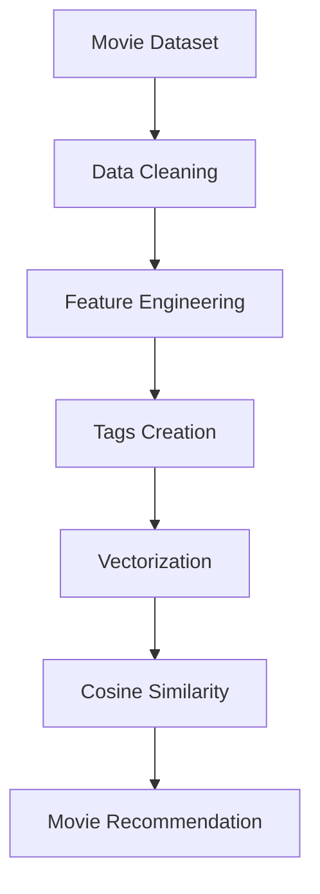

# 🎬 Shukla's Movie Recommender AI

### *Where Artificial Intelligence meets Cinema* 🌌

<p align="center">


</p>

---

<p align="center">


</p>

---

# 🌟 About The Project

CineVerse AI is an advanced AI-powered Movie Recommendation Web App that recommends movies intelligently using Machine Learning and Natural Language Processing.

Built with a cinematic Netflix-inspired UI, this project combines:

* 🎥 Machine Learning
* 🧠 Recommendation Systems
* 🌐 TMDB API
* 🎨 Modern Web UI
* ⚡ Streamlit

to create a beautiful movie discovery experience.

---

# ✨ Features

## 🎬 AI Movie Recommendations

Get smart recommendations based on movie similarity using:

* CountVectorizer
* NLP
* Cosine Similarity

---

## 🌌 Cinematic UI

* Netflix-inspired interface
* Dynamic glowing movie cards
* Dark cinematic theme
* Animated hover effects

---

## 🎭 Mood Based Discovery

Browse movies based on mood:

* Action ⚔️
* Romance ❤️
* Sci-Fi 🚀
* Thriller 🔥
* Fantasy ✨
* Comedy 😂
* Drama 🎭

---

## 🌐 TMDB API Integration

Fetch:

* 🎥 Posters
* ⭐ Ratings
* 📖 Overviews
* 🎞️ Trending Movies

---

# 🖼️ Screenshots

## 🏠 Home Page

<p align="center">
</p>

---

## 🎬 Recommendation Section

<p align="center">
</p>

---

## 🎭 Mood Based Browsing

<p align="center">
</p>

---

# 🧠 Machine Learning Pipeline



---

# ⚙️ Tech Stack

| Technology   | Usage               |
| ------------ | ------------------- |
| Python       | Core Programming    |
| Pandas       | Data Processing     |
| NumPy        | Numerical Computing |
| Scikit-Learn | Machine Learning    |
| Streamlit    | Web Application     |
| TMDB API     | Posters & Metadata  |
| Pickle       | Model Serialization |

---

# 📂 Project Structure

```bash id="yb7nq3"
CineVerse-AI/
│
├── app.py
├── movies.pkl
├── similarity.pkl
├── movie_dict.pkl
├── requirements.txt
├── README.md
├── back.webp
│
├── notebook/
│   └── movie_recommender.ipynb
│
└── screenshots/
    ├── home.png
    ├── recommendation.png
    └── mood.png
```

---

# 🚀 Installation

## 1️⃣ Clone Repository

```bash id="te8k1x"
git clone https://github.com/YOUR_USERNAME/CineVerse-AI.git
```

---

## 2️⃣ Open Project

```bash id="ob9r5m"
cd CineVerse-AI
```

---

## 3️⃣ Install Dependencies

```bash id="a5k8v1"
pip install -r requirements.txt
```

---

## 4️⃣ Run App

```bash id="o1m9d3"
python -m streamlit run app.py
```

---

# 🔑 TMDB API Setup

## Create TMDB Account

[TMDB Official Website](https://www.themoviedb.org/?utm_source=chatgpt.com)

---

## Generate API Key

[TMDB API Settings](https://www.themoviedb.org/settings/api?utm_source=chatgpt.com)

---

## Add API Key

Inside `app.py`:

```python id="s0m4z2"
API_KEY = "YOUR_API_KEY"
```

Replace with your actual TMDB API key.

---

# 📥 Large File Download

https://drive.google.com/drive/folders/1IiXsLk6UPyFX_TpUAgB2L5sP4mkBvwmf?usp=drive_link

# 🌟 Future Enhancements

* 🎞️ Movie Trailer Integration
* 🧠 AI Chatbot Assistant
* 🔍 Voice Search
* ❤️ Personalized Watchlist
* 👤 User Login System
* ☁️ Cloud Deployment
* 🤖 Deep Learning Recommendation Engine

---

# ☁️ Deployment Platforms

| Platform        | Link                                                                        |
| --------------- | --------------------------------------------------------------------------- |
| Streamlit Cloud | [Streamlit Cloud](https://streamlit.io/cloud?utm_source=chatgpt.com)        |
| Render          | [Render](https://render.com/?utm_source=chatgpt.com)                        |
| Railway         | [Railway](https://railway.app/?utm_source=chatgpt.com)                      |
| Hugging Face    | [Hugging Face Spaces](https://huggingface.co/spaces?utm_source=chatgpt.com) |

---

# 📦 requirements.txt

```txt id="q8n1x4"
streamlit
pandas
numpy
scikit-learn
requests
```

---

# 👨‍💻 Author

# Shivam Kumar Shukla (Shukla Ji) 

### B.Tech AI Student

### Future Applied AI Systems Engineer

---

<p align="center">


</p>

---

# 💖 Support The Project

If you liked this project:

⭐ Star the Repository
🍴 Fork the Project
🚀 Share with Friends

---

# 📜 License

This project is licensed under the MIT License.

---

<p align="center">

### ✨ “Cinema is a mirror painted with dreams.” 🎬

</p>
